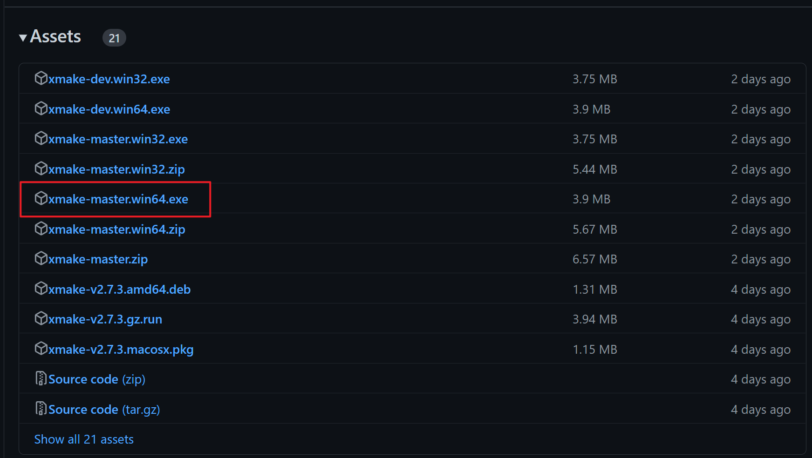
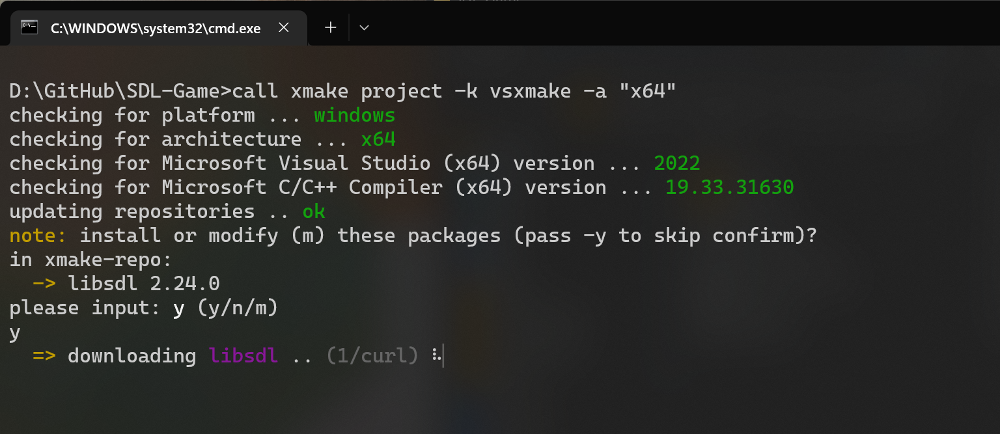
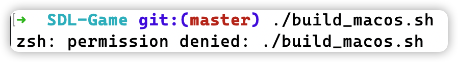
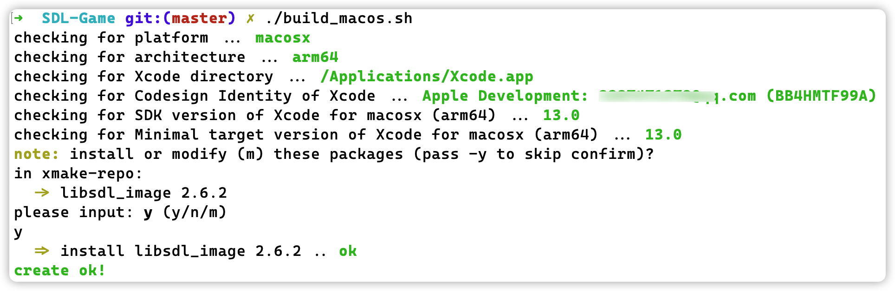

# SDL-Game

## 1. What's It?

This is a 2D game demo built from scratch with SDL2, without any game engine!


## 2. Quick Start

Clone this repository using command `git clone https://github.com/Dont-laugh/SDL-Game.git`. Then open your terminal and browse to the folder of the cloned repository.

### 2.1 Install XMake

This project uses XMake to build automatically. Therefore you have to install XMake first. Here is the link to XMake's official documentation: [Installation - xmake](https://xmake.io/#/guide/installation)

#### 2.1.1 Windows

Go to website: [Releases - xmake.io](https://github.com/xmake-io/xmake/releases). Just download _xmake-master.win64.exe_ is OK.



#### 2.1.2 Mac OS

On Mac OS, you can install XMake with homebrew conveniently:

```sh
brew install xmake
```

### 2.2 Generate Project

Now you are able to generate project files (e.g. *.sln, *.xcworkspace) to open project with your IDE.

#### 2.2.1 Windows

Double click the batch file _build_windows.bat_. You will see like this:



Press y to allow XMake to install dependencies. Now you will find a new folder named like "vsxmake2022" (depends on your Visual Studio version), here locates sln and vcxproj files.

#### 2.2.2 Mac OS

On Mac OS, you may encounter the following permission denied problem:



Run the `chmod` command first of all is very helpful:

```shell
sudo chmod -R 777 ./
```

Afterwards, run file _build_macos.sh_ at repository root directory:

```shell
./build_macos.sh
```

Similarly, type `y` to allow downing dependency:



Now you will find 

### 2.3 Run with XMake

This method is as simple as running the following commands:

```shell
xmake build
xmake run
```

